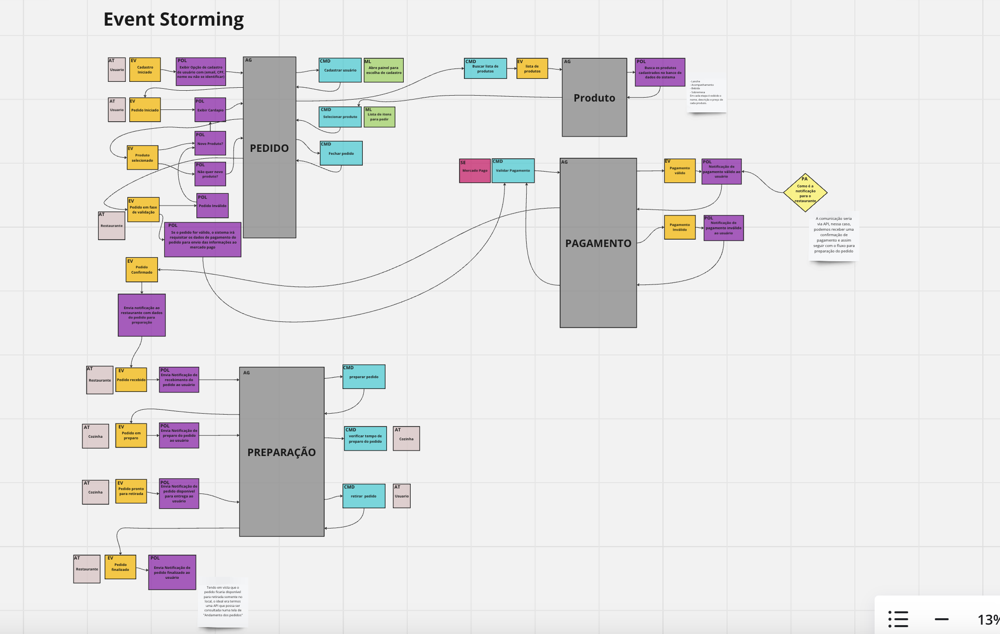

# DigiDine APIs - Tech Challenge - 8SOAT FIAP

O projeto abaixo foi elaborado pelos alunos do grupo 28 do curso de pós graduação (8SOAT FIAP).

## MIRO:
[Modelagem - MIRO](https://miro.com/app/board/uXjVK4JboJA=/)



## EXCALIDRAW:
[Levantamento de Requisitos](https://excalidraw.com/#json=7IW1FzdaOJtW7sb9pB7dX,I8YRQqmzEHJMvKiSabPc6g)

## Buildando e rodando o projeto

### Shell Script

1. De permissão necessaria para os arquivos serem executados `chmod +x apply-all.sh ; chmod +x delete.sh`

2. execute o comando `./apply-all.sh` para realizar o build da aplicação e para iniciar a aplicação.

3. Após rodar o script mostrará as portas correspondentes no minikube conforme exemplo abaixo:

``` 
|-----------|-----------------------|-------------|------------------------|
| NAMESPACE |         NAME          | TARGET PORT |          URL           |
|-----------|-----------------------|-------------|------------------------|
| default   | digidine-service      |             | http://127.0.0.1:38477 |
| default   | mongo                 |             | http://127.0.0.1:38459 |
| default   | mongo-express-service |             | http://127.0.0.1:38491 |
|-----------|-----------------------|-------------|------------------------|
```


### Banco de Dados

1. Para acessar o banco de dados, é necessário utilizar o databse DigiDine, com usuário: `root` e senha: `admin`

## Documentação Swagger:

1. Para acessar a documentação do Swagger, inicie a aplicação e acesse a seguinte url:
- `{url do digidine-service}/swagger-ui/index.html#/`

